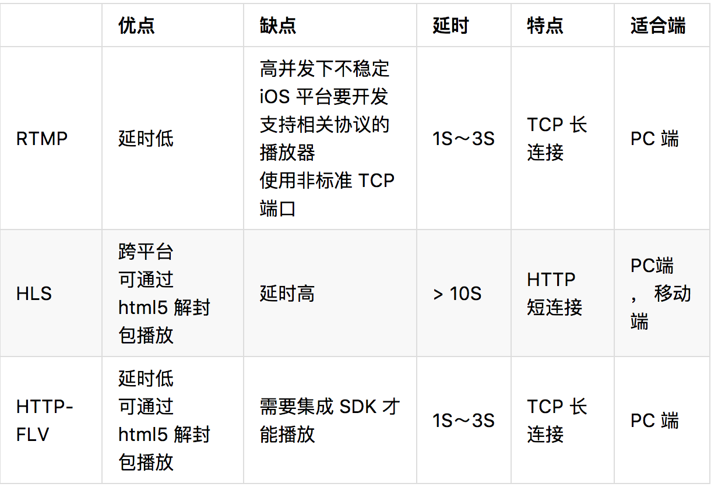

# 多媒体

## Video

[使用html5进行视频播放 （二）](https://zhuanlan.zhihu.com/p/25127524)

[H5-Video 能做的事&存在的坑](https://chimee.org/docs/chimee_player_preface.html)


## 流媒体

### HTTP Live Streaming

[参考](https://imququ.com/post/html5-live-player-1.html)

HTTP Live Streaming（简称 HLS）是一个基于 HTTP 的视频流协议，由 Apple 公司实现，Mac OS 上的 QuickTime、Safari 以及 iOS 上的 Safari 都能很好的支持 HLS，高版本 Android 也增加了对 HLS 的支持。一些常见的客户端如：MPlayerX、VLC 也都支持 HLS 协议。

HLS 协议基于 HTTP，非常简单。一个提供 HLS 的服务器需要做两件事：

- 编码：以 H.263 格式对图像进行编码，以 MP3 或者 HE-AAC 对声音进行编码，最终打包到 MPEG-2 TS（Transport Stream）容器之中；
- 分割：把编码好的 TS 文件等长切分成后缀为 ts 的小文件，并生成一个 .m3u8 的纯文本索引文件；

浏览器使用的是 m3u8 文件。m3u8 跟音频列表格式 m3u 很像，可以简单的认为 m3u8 就是包含多个 ts 文件的播放列表。播放器按顺序逐个播放，全部放完再请求一下 m3u8 文件，获得包含最新 ts 文件的播放列表继续播，周而复始。整个直播过程就是依靠一个不断更新的 m3u8 和一堆小的 ts 文件组成，m3u8 必须动态更新，ts 可以走 CDN。一个典型的 m3u8 文件格式如下：

```bash
BASH#EXTM3U
#EXT-X-STREAM-INF:PROGRAM-ID=1, BANDWIDTH=200000
gear1/prog_index.m3u8
#EXT-X-STREAM-INF:PROGRAM-ID=1, BANDWIDTH=311111
gear2/prog_index.m3u8
#EXT-X-STREAM-INF:PROGRAM-ID=1, BANDWIDTH=484444
gear3/prog_index.m3u8
#EXT-X-STREAM-INF:PROGRAM-ID=1, BANDWIDTH=737777
gear4/prog_index.m3u8
```

可以看到 HLS 协议本质还是一个个的 HTTP 请求 / 响应，所以适应性很好，不会受到防火墙影响。但它也有一个致命的弱点：延迟现象非常明显。如果每个 ts 按照 5 秒来切分，一个 m3u8 放 6 个 ts 索引，那么至少就会带来 30 秒的延迟。如果减少每个 ts 的长度，减少 m3u8 中的索引数，延时确实会减少，但会带来更频繁的缓冲，对服务端的请求压力也会成倍增加。所以只能根据实际情况找到一个折中的点。


## 直播技术

视频直播服务目前支持三种直播协议，分别是RTMP、HLS、FLV [以下内容来自阿里云帮助中心](https://help.aliyun.com/knowledge_detail/49785.html)

- RTMP `实时消息传输协议，由Adobe公司研发，但当前还没有收入国际标准（wikipedia）`。协议比较全能，既可以用来推送又可以用来直播，其核心理念是将大块的视频帧和音频帧“剁碎”，然后以小数据包的形式在互联网上进行传输，且支持加密，因此隐私性相对比较理想，但拆包组包的过程比较复杂，所以在海量并发时容易出现一些不可预期的稳定性问题。
- HLS 协议：`基于HTTP协议的流直播（wikipedia）`。苹果推出的解决方案，将视频分成 5-10 秒的视频小分片，然后用 m3u8 索引表进行管理。由于客户端下载到的视频都是 5-10 秒的完整数据，故视频的流畅性很好，但也同样引入了很大的延迟（HLS 的一般延迟在 10-30s 左右）。相比于 FLV， HLS 在iPhone 和大部分 Android 手机浏览器上的支持非常给力，所以常用于 QQ 和微信朋友圈的 URL 分享。
- HTTP-FLV 协议由 Adobe 公司主推，格式极其简单，只是在大块的视频帧和音视频头部加入一些标记头信息，由于这种极致的简洁，在延迟表现和大规模并发方面都很成熟。唯一的不足就是在手机浏览器上的支持非常有限，但是用作手机端 APP 直播协议却异常合适。

下面看一下三种技术的对比：



# video.js

[中文文档](https://github.com/ShmilyLin/video.js.zh-cn#)


# Preload

[google Developers](https://developers.google.com/web/fundamentals/media/fast-playback-with-video-preload)

[翻译](https://www.jishuwen.com/d/2Wnx)


# hls.js

[git](https://github.com/video-dev/hls.js/)

[hls.js 源码解读【1】](https://juejin.im/entry/5a02d0d2f265da43284049b0)


# Video html

[developers.google](https://developers.google.com/web/fundamentals/media/video)


# Media Source Extensions

[developers.google](https://developers.google.com/web/fundamentals/media/mse/basics)

[MDN](https://developer.mozilla.org/zh-CN/docs/Web/API/MediaSource)

[Video](https://developer.mozilla.org/zh-CN/docs/Web/HTML/Element/video)

> 之前浏览器提供的媒体播放功能，不提供 分段加载，缓冲能力
>
> 现在客户端可以完全在JavaScript中预取和[缓冲](https://zh.wikipedia.org/wiki/緩衝器)[流媒体](https://zh.wikipedia.org/wiki/流媒体)的代码