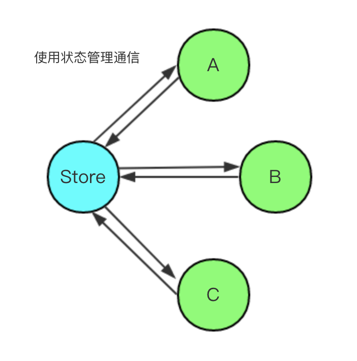

# 状态管理

[对 React 状态管理的理解及方案对比](https://github.com/sunyongjian/blog/issues/36)

state 自上而下流向、Props 只读


# setState

https://juejin.im/post/5aa25967518825558251f61f


# React组件之间的通信

[React组件之间的通信](https://github.com/sunyongjian/blog/issues/27)


# Transaction

[React中的Transaction](https://oychao.github.io/2017/09/25/react/16_transaction/)

类比**AOP**（面向切面编程）

 ```javascript
<pre>
 *                       wrappers (injected at creation time)
 *                                      +        +
 *                                      |        |
 *                    +-----------------|--------|--------------+
 *                    |                 v        |              |
 *                    |      +---------------+   |              |
 *                    |   +--|    wrapper1   |---|----+         |
 *                    |   |  +---------------+   v    |         |
 *                    |   |          +-------------+  |         |
 *                    |   |     +----|   wrapper2  |--------+   |
 *                    |   |     |    +-------------+  |     |   |
 *                    |   |     |                     |     |   |
 *                    |   v     v                     v     v   | wrapper
 *                    | +---+ +---+   +---------+   +---+ +---+ | invariants
 * perform(anyMethod) | |   | |   |   |         |   |   | |   | | maintained
 * +----------------->|-|---|-|---|-->|anyMethod|---|---|-|---|-|-------->
 *                    | |   | |   |   |         |   |   | |   | |
 *                    | |   | |   |   |         |   |   | |   | |
 *                    | |   | |   |   |         |   |   | |   | |
 *                    | +---+ +---+   +---------+   +---+ +---+ |
 *                    |  initialize                    close    |
 *                    +-----------------------------------------+
 * </pre>

 ```


# React Context

[聊一聊我对 React Context 的理解以及应用](https://juejin.im/post/5a90e0545188257a63112977)

生产者消费者模式

# 第三方状态管理

## 为什么需要

### 1. 复杂度




### 2. 变化与异步混淆


# redux


### 1. 基本使用 

> **Redux 应用只有一个单一的 store**。当需要拆分数据处理逻辑时，你应该使用 [reducer 组合](https://www.redux.org.cn/docs/basics/Reducers.html)而不是创建多个 store。


#### action与action创建函数

action 本身是一个JavaScript对象——作为一个标识

action 创建函数 是一个动态批量创建action的函数


#### Reducer

```react
(previousState, action) => newState
```


```js
//拆分 reducer
combineReducers()
```


#### Store

##### 1. Store 有以下职责：

- 维持应用的 state；
- 提供 [`getState()`](https://www.redux.org.cn/docs/api/Store.html) 方法获取 state；
- 提供 [`dispatch(action)`](https://www.redux.org.cn/docs/api/Store.html) 方法更新 state；
- 通过 [`subscribe(listener)`](https://www.redux.org.cn/docs/api/Store.html) 注册监听器;
- 通过 [`subscribe(listener)`](https://www.redux.org.cn/docs/api/Store.html) 返回的函数注销监听器。


### 2. react-redux

基于 [容器组件和展示组件相分离](https://medium.com/@dan_abramov/smart-and-dumb-components-7ca2f9a7c7d0) 的开发思想


# Mobx

[Mobx React  最佳实践](https://juejin.im/post/5a3b1a88f265da431440dc4a)

[mobx学习总结](https://segmentfault.com/a/1190000013810512)

[官方文档](https://cn.mobx.js.org/) 

[使用mobx开发高性能react应用](https://foio.github.io/mobx-react/)

## 基本

#### 1. 核心概念

> 原则：state尽可能的小
>
> 分为：普通模式与严格模式`Mobx.configure({ enforceActions: true });`


> 当应用状态更新时，所有依赖于这些应用状态的监听者（包括UI、服务端数据同步函数等），都应该自动得到细粒度地更新。

1. State

2. computed ——autorun (区别是autorun不会被GCC自动回收)

3. action—— 唯一修改state的途径

   ```javascript
   @action.bound //类似于 bind(所以不能与箭头函数一起使用)
   ```


#### 2. 异步处理

只需要`action`就可以了

**需要注意： action中异步处理回调需要修改observable的值，那么该回调也需要绑定action，且注意action中回调的this问题**

解决this问题

```javascript
//方案1 使用@action.bound
const Mobx = require("mobx");
Mobx.configure({ enforceActions: true });
const { observable, autorun, computed, extendObservable, action } = Mobx;
class Store {
  @observable a = 123;

  @action
  changeA() {
    this.a = 0;
    setTimeout(this.changeB, 1000);
  }
  @action.bound
  changeB() {
    this.a = 1000;
  }
}
var s = new Store();
autorun(() => console.log(s.a));
s.changeA();
```


```javascript
//方案2——直接包裹action

  @action
  changeA() {
    this.a = 0;
    setTimeout(action('changeB',()=>{
      this.a = 1000;
    }), 1000);
  }
}

```


```javascript
//方案3 使用runInAction 解释：runInAction(f) 是 action(f)() 的语法糖。
@action
  changeA() {
    this.a = 0;
    setTimeout(
      runInAction(() => {
        this.a = 1000;
      }),
      1000
    );
  }
```

#### 3. 一些难点

1. 无法监听`Object`新增属性，但可以通过`extendObservable(target, props)`来实现
2. 作用域的问题


#### 4. mobx-react

[【译】MobX：MobX 和 React 十分钟快速入门](https://www.zcfy.cc/article/mobx-ten-minute-introduction-to-mobx-and-react-4306.html?t=new)


#### 5. demo

官方基本 https://github.com/mobxjs/mobx-react-boilerplate