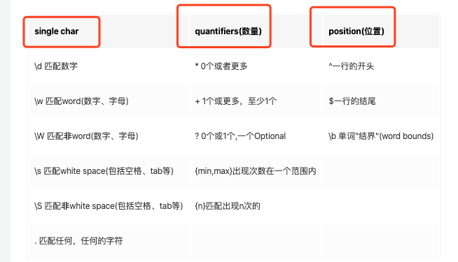

# 基本

https://juejin.im/post/5b5db5b8e51d4519155720d2

# 深入理解—正则表达式

[进阶正则表达式](https://www.barretlee.com/blog/2014/01/18/cb-how-regular-expressions-work/)

## 核心理论—回溯

[正则表达式回溯法原理](https://zhuanlan.zhihu.com/p/27417442)

正则表达式匹配字符串的这种方式，有个学名，叫回溯法。

回溯法也称试探法，它的基本思想是：从问题的某一种状态（初始状态）出发，搜索从这种状态出发所能达到的所有“状态”，当一条路走到“尽头”的时候（不能再前进），再后退一步或若干步，从另一种可能“状态”出发，继续搜索，直到所有的“路径”（状态）都试探过。这种不断“前进”、不断“回溯”寻找解的方法，就称作“回溯法”。（copy于百度百科）。

本质上就是深度优先搜索算法。**其中退到之前的某一步这一过程，我们称为“回溯”。**从上面的描述过程中，可以看出，路走不通时，就会发生“回溯”。即，**尝试匹配失败时，接下来的一步通常就是回溯。**

本质上 是深度优先算

