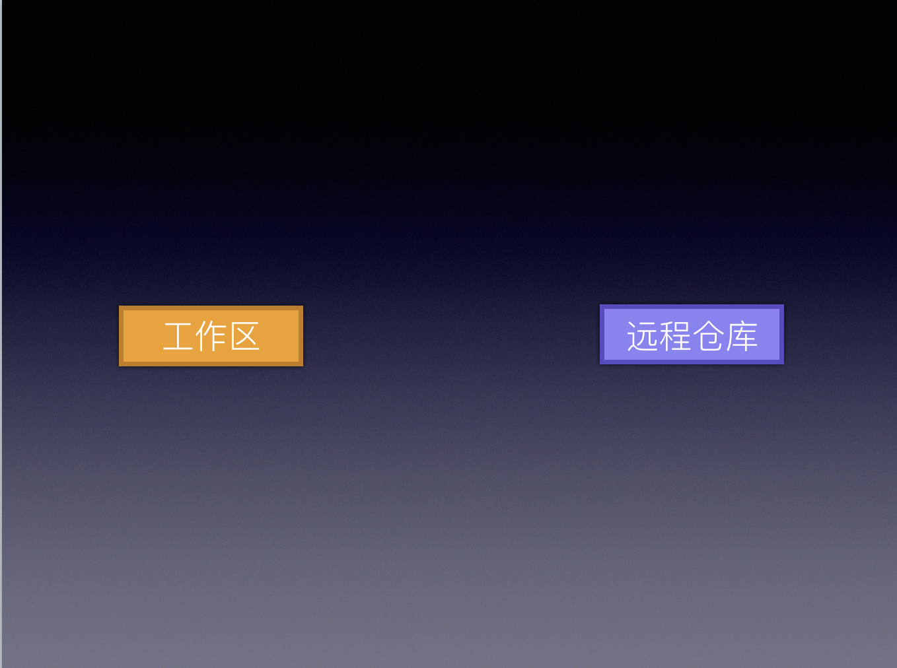
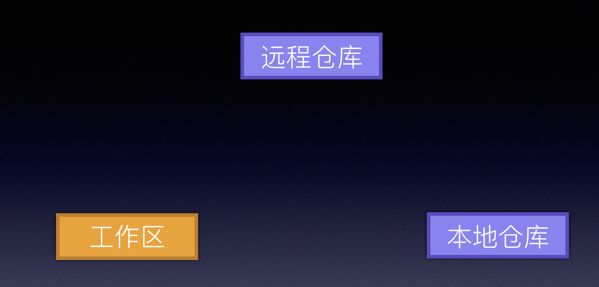
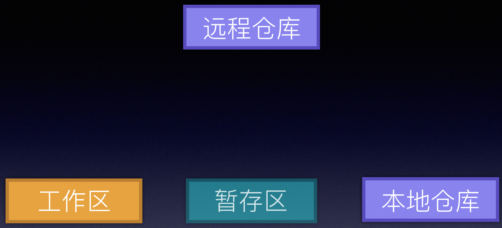
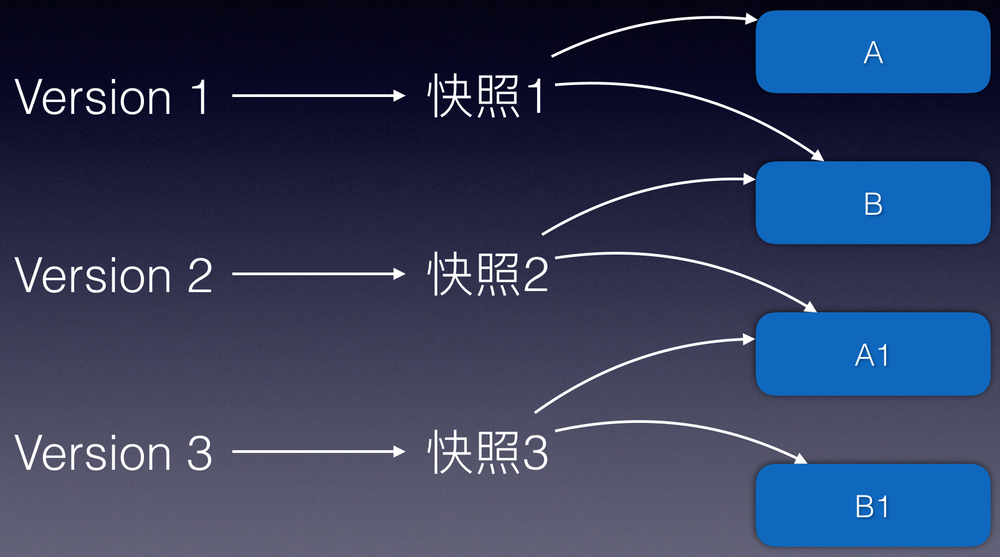
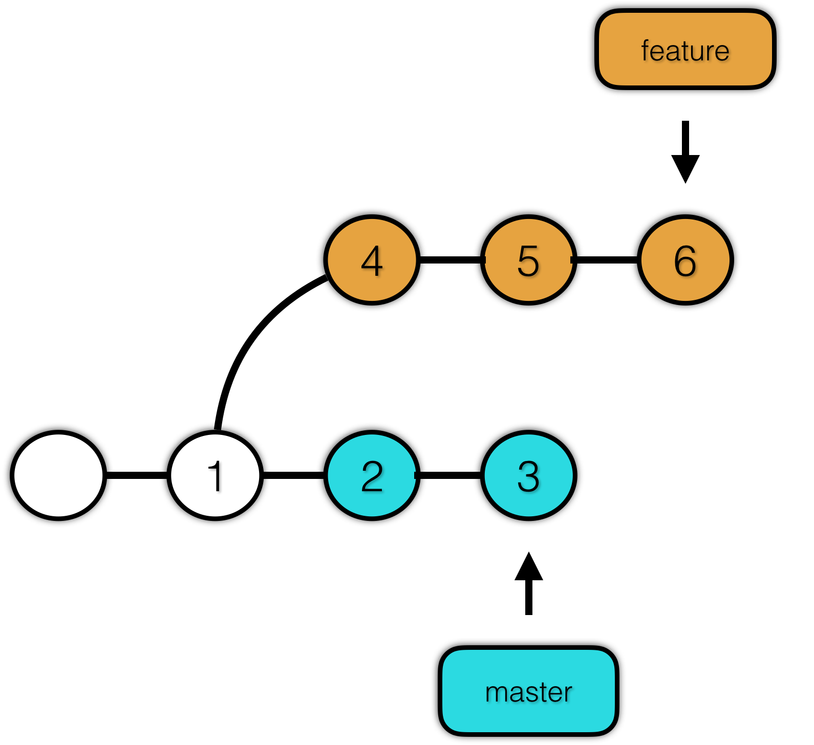

# GIt 工作流

参考：[本文主要参考](https://coding.net/help/doc/practice/git-principle.html)

[官方文档-中文](https://git-scm.com/book/zh/v1/%E8%B5%B7%E6%AD%A5)

[一个很好用的git学习工具](https://learngitbranching.js.org/?demo)

## 原理

### 1. 基本演变（原理）

最简单



但是作为一个目标明确的分布式版本控制系统，首先要做的就是添加一个本地仓库。



接着我们选择在工作目录与远程仓库中间加一个缓冲区域，叫做暂存区。



加入暂存区的原因有以下几点：

1. 为了能够实现部分提交
2. 为了不再工作区创建状态文件、会污染工作区。
3. 暂存区记录文件的修改时间等信息，提高文件比较的效率。


### 2. 快照


这是项目的三个版本，版本1中有两个文件A和B，然后修改了A，变成了A1，形成了版本2，接着又修改了B变为B1，形成了版本3。

如果我们把项目的每个版本都保存到本地仓库，需要保存至少6个文件，而实际上，只有4个不同的文件，A、A1、B、B1。为了节省存储的空间，我们要像一个方法将同样的文件只需要保存一份。这就引入了Sha-1算法。

> 一个 version——可能不会使所有的文件都改变了 




### 3. 文件状态

> 因为有 工作区——> 暂存区——> 本地仓库——>远程仓库
>
> 所以，一个文件有多个状态


### 4. 分支

[深入研究](https://git-scm.com/book/zh/v1/Git-%E5%88%86%E6%94%AF-%E4%BD%95%E8%B0%93%E5%88%86%E6%94%AF)

> 分支仅仅是一个指针

```node
refs/heads/master  ## 分支目录
```


## 实践

### 常用功能

```sh
git log --graph --pretty=oneline --abbrev-commit  ## 查看提交树状图
```


### 1. 一般提交（Add&Commit）

```node
 README.md//修改文件
git add README.md   //提交到缓存区
git commit -m "add readme” // 永久保存在本地仓库(通过sha-1算法，将内容转化为blob)
```


### 2. 解决冲突（Merge & Rebase）

#### 产生冲突原因:

> ###一般版本只需要移动指针就能解决问题，但移动指针不能解决问题时，就需要我们来解决冲突


类似于下图情况：



来细细品味上图，那些场景需要手动解决冲突(搞个解决冲突算法)

**上图我们只需要比较三个版本（1，3，6）** 

```javascript
for （版本1、版本3、版本6中对每个文件进行逐次比对遍历）{
    if 版本1、版本3、版本6的 sha-1 值完全相同，这种情况表明没有冲突
    else if 版本3或6至少一个与版本1状态相同（指的是sha-1值相同或都不存在），这种情况可以自动合并。比如1中存在一个文件，在3中没有对该文件进行修改，而6中删除了这个文件，则以6为准就可以了
    else if 版本3或版本6都与版本1的状态不同，情况复杂一些，自动合并策略很难生效，需要手动解决。我们来看一下这种状态的定义。
    
}
```

#### merge

Merge 之后还可以做新提交


#### Rebase

> Rebase 是**逐此**提交与版本3 进行比较
>
> 可能多次解决冲突


https://juejin.im/post/5b46c784f265da0f540513cd


```sh
git rebase master
```

提示：


发现 myfile.txt 代码冲突了

```sh
vim myfile.txt

git add myfile.txt

git rebase --continue
```

```sh
## 切换分支
git checkout master
git merge test
```


### 3. 压缩提交（todo）

> 所谓压缩提交，就是将多个提交合并为一个


### 4. 版本回退revert&reset(todo)

> 一般分为 在  工作区&暂存区  与 本地仓库与远程仓库

#### 具体解决

```
git status       //有提示
git checkout -- <file>  //未提交到远程
git checkout .
```


```linux
//提交到仓库后 也就是 commit命令后
git reset --hard HEAD
git push -f origin master  //强制提交到远程分支 同名分支
```


```
git reflogre
```


### 5. stash(todo)

> 我们在一个分支上做了一些工作，修改了很多代码，而这时需要切换到另一个分支干点别的事。但又不想将只做了一半的工作提交。


### 6.bisect(todo)


### 7. 分支管理

#### 创建

``` sh
git branch dev ## 创建分支
 git checkout -b dev  ## 创建分支 并切换到 Dev 分支
```

#### 删除

``` sh
git branch -d dev  ## 删除 dev分支
```


## 拉取远程分支并创建

```sh
## 方法一
git checkout -b 本地分支名x origin/远程分支名x
## 方法二
git fetch origin 远程分支名x:本地分支名x
```


### 8. [解决 git clone 慢的问题](https://blog.colafornia.me/post/2018/slove-git-clone-speed/)

Git 仓库体积太大

#### commit 历史长，协作分支多导致的仓库自身体积变大

① 浅克隆 shallow clone

```
git clone --depth n git://someserver/somerepo
```

② 只 clone 一个分支

```
git clone URL --branch branch_name --single-branch [folder]
```

一般可以指定只 clone master 分支到本地，同样了节省了很多时间。

#### 有过多的二进制文件

稀疏检出 sparse checkout

大文件储存 Git LFS

# git hook

## 1.分类

客户端hooks（Client-Side Hooks）和服务端hooks（Server-Side Hooks）

### Client-Side Hooks

- pre-commit: 执行`git commit`命令时触发，常用于检查代码风格
- prepare-commit-msg: `commit message`编辑器呼起前`default commit message`创建后触发，常用于生成默认的[标准化的提交说明](https://conventionalcommits.org/)
- commit-msg: 开发者编写完并确认`commit message`后触发，常用于校验提交说明是否标准
- post-commit: 整个`git commit`完成后触发，常用于邮件通知、提醒
- applypatch-msg: 执行`git am`命令时触发，常用于检查命令提取出来的提交信息是否符合特定格式
- pre-applypatch: `git am`提取出补丁并应用于当前分支后，准备提交前触发，常用于执行测试用例或检查缓冲区代码
- post-applypatch: `git am`提交后触发，常用于通知、或补丁邮件回复（此钩子不能停止`git am`过程）
- pre-rebase: 执行`git rebase`命令时触发
- post-rewrite: 执行会替换`commit`的命令时触发，比如`git rebase`或`git commit --amend`
- post-checkout: 执行`git checkout`命令成功后触发，可用于生成特定文档，处理大二进制文件等
- post-merge: 成功完成一次 `merge`行为后触发
- pre-push: 执行`git push`命令时触发，可用于执行测试用例
- pre-auto-gc: 执行垃圾回收前触发

### Server-Side Hooks

- pre-receive: 当服务端收到一个push操作请求时触发，可用于检测push的内容
- update: 与pre-receive相似，但当一次push想更新多个分支时，pre-receive只执行一次，而此钩子会为每一分支都执行一次
- post-receive: 当整个push操作完成时触发，常用于服务侧同步、通知


## husky


# 常用 

## tag

```git
## 创建
git tag ##名称
## 提交
git push --tags
```


## 统计代码量

```sh
git log --author="xxxx" --since="2020-06-22" --until="2020-07-30" --pretty=tformat: --numstat | awk '{ add += $1; subs += $2; loc += $1 - $2 } END { printf "added lines: %s, removed lines: %s, total lines: %s\n", add, subs, loc }' -
```

